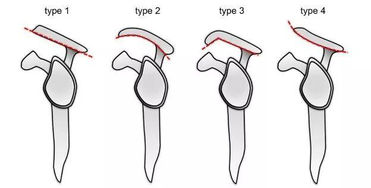
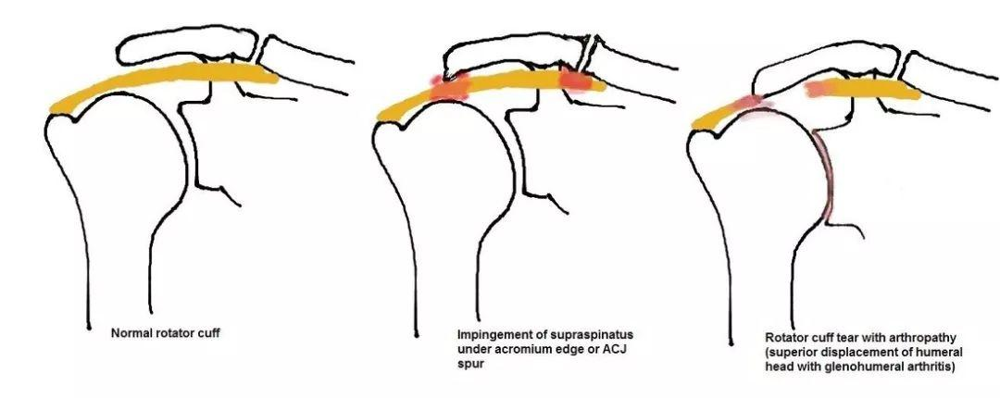

# 1. 肩峰撞击及原因

> 肩峰和肱骨大结节之间间隙变窄，抬胳膊时里面的肌腱、滑囊被夹到、摩擦发炎。

1 先天骨骼结构

> 钩型肩峰、弯曲型肩峰，天生肩峰下间隙就窄，比平直型更容易卡压

补充肩峰形态：

常见的肩峰形状有
- I型（扁平型）占18.4%
- II型（弯曲型）占52.6%
- III型（钩型）占29.0%
- IV型：反弧形或上翘型

导致的肩峰下撞击和肩袖撕裂的示意图

2. 肩峰骨赘、骨质增生

> 年龄增长、劳损后肩峰下缘长骨刺，直接挤占空间。

# 2. 肌肉力量（常见后天原因）

## 2.1 肩袖肌群薄弱

冈上肌、冈下肌无力，兜不住肱骨头，抬臂时骨头往上跑，顶到肩峰。

## 2.2 胸肌、背阔肌过紧

## 2.3 肩胛控制差