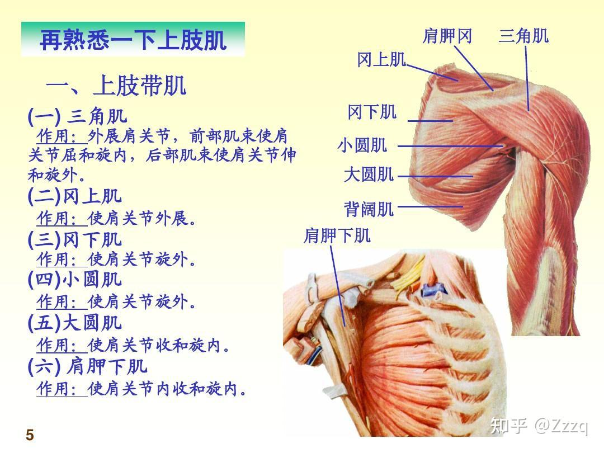

肩部肌肉主要包含肩带肌及功能：
- 三角肌
    - 外展肩关节，前束部分使得[肩关节屈](#肩关节屈外展后伸)，后部肌肉使肩关节伸和旋外
- 冈上肌
    - 使肩关节外展
- 冈下肌
    - 使肩关节旋外（和外展区分，肱骨绕自身长轴向外旋转，例如招财猫动作）
- 小圆肌
    - 使肩关节旋外（和外展区分，肱骨绕自身长轴向外旋转，例如招财猫动作）
- 大圆肌
    - 使肩关节收和旋内
- 肩胛下肌
    - 使肩关节内收和旋内

# 补充说明

## 肩关节屈、外展、后伸

- 屈：从身体前方，向上往前抬
- 外展：侧面抬
- 后伸：向后摆